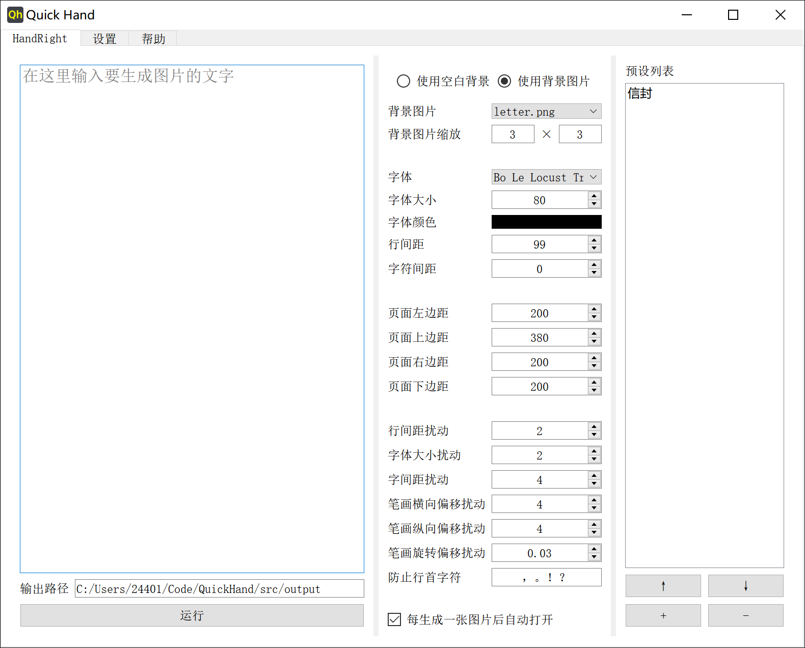
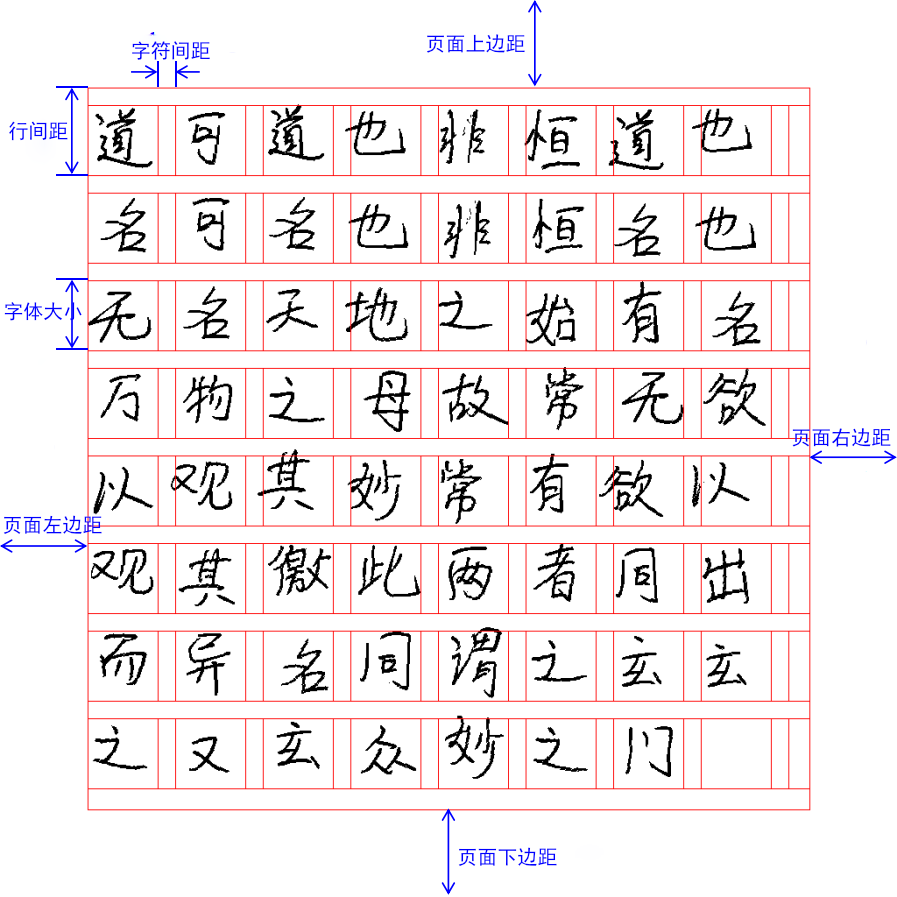

#   Quick Hand

## 📝 Introduction

A fast handwritten-style text image generator. GUI wrapper for [Handright](https://github.com/Gsllchb/Handright/).

Open source and free to use. Downloads on the [Release](https://github.com/mkaaad/QuickHand/releases) page.

Screenshot:



## 🔮 Usage

Core idea: random perturbation of each character in horizontal position, vertical position, and font size, followed by per-stroke perturbation in horizontal position, vertical position, and rotation angle — producing realistic handwriting effects.

Windows: download archive, unzip, double-click `QuickHand.exe`.

- Put your font files (ttf/otf) in the `fonts` folder
- Put background images in the `backgrounds` folder

Parameter reference:



## 🔨 Build

Pre-built binaries for all platforms are built by GitHub Actions on tag push:

| Platform | Runner | Artifact |
|----------|--------|----------|
| Windows x86_64 | `windows-latest` | `.rar` |
| Linux x86_64 | `ubuntu-latest` | `.tar.gz` |
| macOS x86_64 | `macos-13` | `.tar.gz` |
| macOS arm64 | `macos-latest` | `.tar.gz` |

Push a `v*` tag to trigger the build; artifacts are published to the Release automatically.

To build locally:

```bash
pip install -r requirements.txt pyinstaller
cd src
pyinstaller --noconfirm -w \
  --hidden-import pkg_resources.py2_warn \
  -i icon.ico \
  --add-data "database.db:." \
  --add-data "style.css:." \
  --add-data "icon.ico:." \
  --add-data "fonts:fonts" \
  --add-data "backgrounds:backgrounds" \
  QuickHand.py
```

> On Windows, replace `:` with `;` in `--add-data` flags.

After building, copy `fonts`, `backgrounds`, `database.db`, `style.css` etc. to the output directory.

## 😀 Feedback

Open an [Issue](https://github.com/mkaaad/QuickHand/issues) on GitHub.
